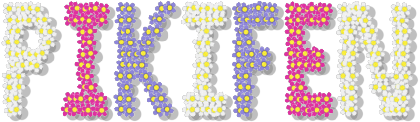

  

_Pikifen_, a fan-made _Pikmin_-based engine for players to make and play their own _Pikmin_ fan content in.  
Made with ♡ by Espyo.

  

> * [Overview](#overview)
> * [Notable features](#notable-features)
> * [Get the latest version](#get-the-latest-version)
> * [Playing and making](#playing-and-making)
> * [What's left](#whats-left)
> * [Troubleshooting](#troubleshooting)
> * [Contributing](#contributing)
> * [Disclaimer](#disclaimer)

The included manual (download _Pikifen_ and open `manual.html`) contains, amongst other things, tutorials, the changelog, troubleshooting information, compilation instructions, an FAQ, and credits.

## Overview

**_Pikifen_** (formerly Pikmin fangame engine) is an engine capable of creating and playing _Pikmin_ fan content. Think of it like a "_Pikmin Maker_". It is an open-source engine, currently under development, with gameplay very similar to the _Pikmin_ games, in that leaders can whistle and throw Pikmin, Pikmin can carry objects, and so on.

The idea is for fans to create their own content (enemies, areas, etc.), while the engine itself handles the game logic (like physics, scripting, and so on) as well as reading the game data to turn it all into something playable. That said, the project also comes with some base content, so you can experiment with its features right away.

Its most recent version, in alpha, is available for download with the methods later in this readme. The engine can run on Windows, Linux, and Mac. Being a PC game, it is played using a keyboard, mouse, and/or a controller.
    
The game playable by the engine has a 2-dimensional look, and is seen from an orthographic top-down view, although it is still a 3-dimensional game, in that height and gravity exist. The mechanics attempt to mimic those found in the _Pikmin_ games, although not always to the same degree. They can be different because it's easier that way, it's better for the engine's flexibility, or because it's not possible to fully replicate what happens in the canon games.
    
Depending on the area the player selects, they can either explore around freely without a care, or they must complete a mission, usually with some goal, fail conditions, and scoring criteria. More game modes and ways of playing will be added in the future. Since it is still in development, different features may be fully implemented, missing entirely, or working incorrectly.

## Notable features

* Replicates most of the standard _Pikmin_ gameplay.
* Replicates some of the more complex features, such as dynamic music or Go Here!
* Unique features like weather conditions, complex missions, and more.
* Content that can be edited via text files, or by just replacing the image and sound files.
* Intuitive and deep editors, such as an area editor, animation editor, and more. (Made with [Dear ImGui](https://github.com/ocornut/imgui)!)
* Scripting for custom objects using finite state machines.
* Tools to help with debugging custom content.
* A comprehensive but easy-to-follow manual to help with making content.
* Customizable control schemes.
* Filled with quality-of-life features and details, both for gameplay and for content-making.
* Fairly low system requirements, no special permissions to run, no need to install, and less than 50 MB when extracted.
* Made almost entirely from scratch, as free and open-source software, for Windows, Linux (Steam Deck too!), and Mac.
* Organized codebase with very few external dependencies.

## Get the latest version

### Upgrading from an older version

If you are upgrading from an older version of the engine, you should extract it into a new folder and use that one instead. If you do this, remember to copy over the `user_data` folder from the previous version, if you care about your settings and personal backups. If you have any custom-made content you want to keep, copy that too, and remember to also follow any instructions noted in the changelog, inside the included manual.
If you just extract the new version into the same folder as the old one, you risk having files you care about be replaced, as well as keeping old files that the new version doesn't use and end up wasting space.

### Windows
The latest version available for download for Windows is shown at the top of the [GitHub releases page](https://github.com/Espyo/Pikifen/releases). Just unzip the downloaded zip file onto a folder, and double-click `pikifen.exe` to start running. If you have downloaded a zip file in hopes of just playing the engine, but can't find any `pikifen.exe` file to double-click, then check if there's a `source` folder. If there is, you've downloaded the wrong zip file. Use the one in the [releases page](https://github.com/Espyo/Pikifen/releases).

Alternatively, you can download the source code and compile it to get the most up-to-date features; compilation instructions can be found in the included manual.
        
### Linux and Mac
In order to play on Linux or Mac, you can build it from the source code. A simple tutorial on how to compile the engine can be found in the included manual.
Alternatively, you can run the Windows executable under Wine. It works fairly well, though if you run into issues, check the included manual's troubleshooting page.

## Playing and making

* To play, just double-click `pikifen.exe` (if you can't find it, make sure you followed "Get the latest version" above), then pick an area and start playing!
* To make content for the engine, just edit the image, sound, or text files in the `game_data` folder. Some things can also be edited using the built-in editors.
* Alternatively, you can download some content made by other players (check the [Discord server](https://discord.gg/qbhz4u3)!)
* This project is still under construction, so expect some things to be incomplete!
* For more detailed information, including tutorials, please check the included manual.

## What's left

To know what still needs to be done in the project, please check the included manual's History and roadmap page for a general overview, or the project's [todo file](https://github.com/Espyo/Pikifen/blob/master/source/documents/todo.txt) for details.

## Troubleshooting

If you have any issue, please check the included manual's troubleshooting and FAQ pages.

## Contributing

Please see the [contributing file](https://github.com/Espyo/Pikifen/blob/master/contributing.md).

## Disclaimer

Project licensing info can be found in `license.txt`.
    
Trademark and copyright of _Pikmin_ belongs to Nintendo.  
_Pikifen_ and any fan content run within it are not affiliated with Nintendo, do not replace any official Nintendo content, do not contain any copyrighted assets, and can not be sold.  
They are non-commercial projects created by fans of the _Pikmin_ franchise for entertainment and educational purposes only.
